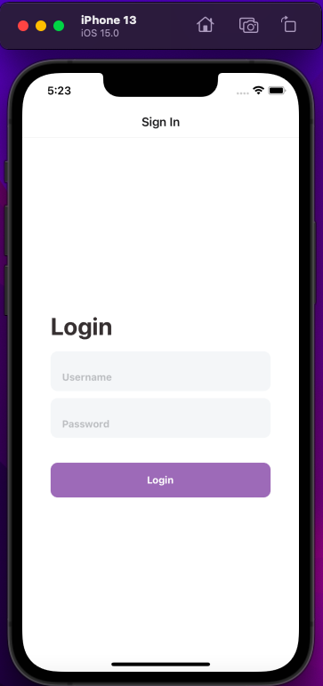
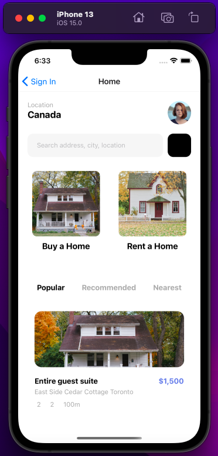
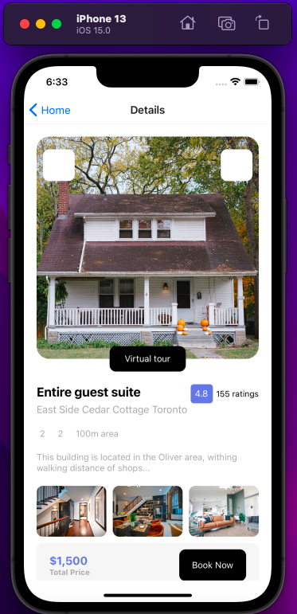
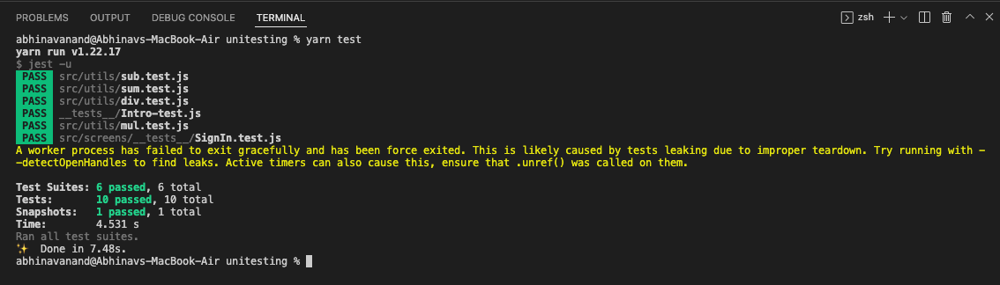
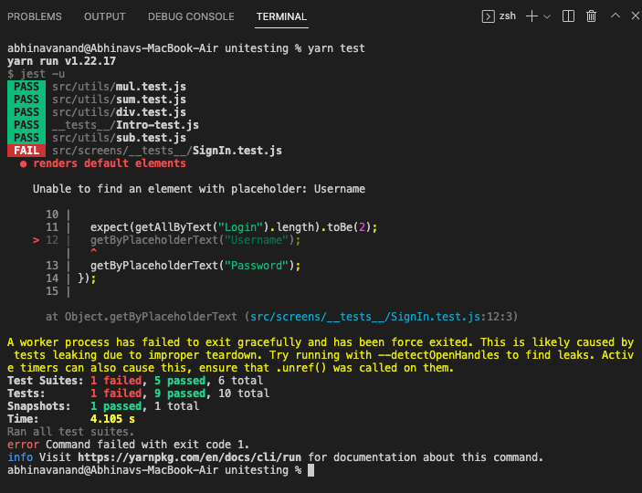

# unitesting
## This repository is about the "UNIT TESTING" &amp; "Snapshot Testing".

### Screenshot:

### ``` Login Screen ```

<div align="center">
  
  </div>
  
### ``` Home Screen ```

<div align="center">
  
  </div>
  
### ``` Details Screen ```

<div align="center">
  
  </div>

### ``` Terminal --> TEST PASSED ```



### ``` Terminal --> TEST FAILED ```


